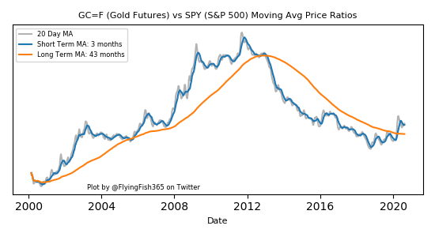

# Financial Market Perspectives
## Ratio charts of key Exchange Traded Funds and other assets. 
## Primarily against the S&P 500 and Gold. 
### Ratio charts give long term perspective on which assets are outperforming the base asset class.
  
#### Note how Gold outperformed the S&P 500 from about 2001 to 2011, then the S&P 500 had been better until recently.
#### Observing that Gold has moved significantly higher in 2020.

### See the disclaimers in the "XLSX" file - very important - nothing here is investment advice.
### Click on the "xlsx" file, it won't preview in Github, but to the right there will be a download button.
### Open your local copy with Microsoft Excel, or newer versions of Open Office Calc.
#### Note: you can get Open Office free from the web

### On Twitter: @FlyingFish365 for questions, comments, suggestions, discussion.

#### Very much a new project, so expect additions, enhancements and clarifications!
#### Source code in Python will be added when it has been cleaned up some.
